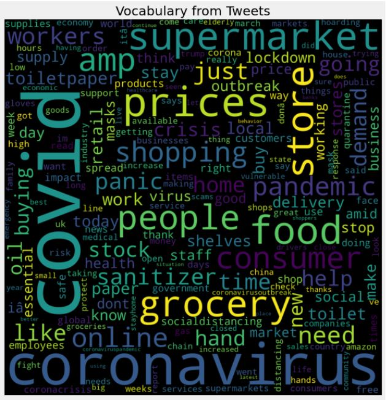
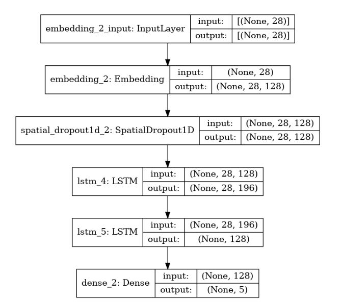

# COVID-Tweet-Classification-Model
This model aims to classify tweets related to COVID-19 into positive or negative. 
It basically implements the text classification application of the Natural Language Processing.

### Dataset
The model is trained using the kaggle dataset of tweets regarding COVID-19.
It is in the form of CSV file. The tweets have been pulled from Twitter and manual tagging has been done later. 
The names and usernames have been given codes to avoid any privacy concerns.

The columns present in the dataset are:
1. Location
2. Tweet At
3. Original Tweet
4. Label

### Technologies Used
The model uses a deep neural network based model to classify the tweets. We have used a LSTM model with word embedding layers provided by tensorflow. 
The following libraries have been used in the implementation of this model:
1. Numpy
2. Pandas
3. Matplotlib
4. Seaborn
5. NLTK
6. Word Cloud
7. Sklearn
8. Tensorflow
9. Keras

### Implementation
We start with the data exploration and analysis. We tried to plot bar plot for the tweets depending upon the sentiments, to get a clear idea about the data. 
#### Data Preprocessing: 
The data had sentiments like Positive, Negative, Neutral, Extremely Positive and Extremely Negative. 
We cut short these sentiments into Positive (containing Positive, Extremely Positive and Neutral) and Negative (containing Negative and Extremly Negative) only.  
After that we removed the URLs, HTML tags, numeric digits and punctuation marks from the tweets in order to focus better on the words. 
Further we converted all letters into lower case.  
Then we appended the dataset with the sentence length of each tweet and plotted a bar chart to get an idea of majority tweets length range. 
Finally we created the word corpus by adding all the unique words. We further divide the corpus into positive and negative sentiment corpuses.

#### Data Visualization: 
After the data preprocessing, we used the frequency of the words in our corpus to create a Word Cloud for our dataset. The output was like this:

#### Model Training: 
We have used a tensorflow based deep neural network model for the classification. For the classification, we have used the tweet text and labels only. 
We used the Tensorflow tokenizer to tokenize the tweets. To make all the tweets of same length we have used padding in the end.  

So our feature vector (X) consists of the padded token sequences and target vector (Y) consists the labels. 
Using a 80% training and 20% test data, we have trained the data on our model having the following architecture:

The word embedding layers are responsible for converting the string tokens into numbers so that they can be used for learning in the neural network model. 
The dropout layer ensures that the best architecture of no. of units in each hidden layer is used for the model. 
LSTM layers are used because the tweets have a context related which needs to be captured using the memory component of LSTM layers. 
Finally using the dense layer to provide a feed forward neural network learning.  

We have used Binary Cross-entropy as loss function, Adam as the optimizer and accuracy as the performance metric. 
Finally we used a batch size of 128 to fit the data on our model with 100 epochs. The model is finally saved for future use.

### Performance Analysis
The model after training is tested for loss value and accuracy metric. It shows a minimal loss of 0.03944019973278046 and accuracy score of 0.9753075242042542. 
This shows that the model has fairly decent performance and gives an accuracy of around 97.5%
